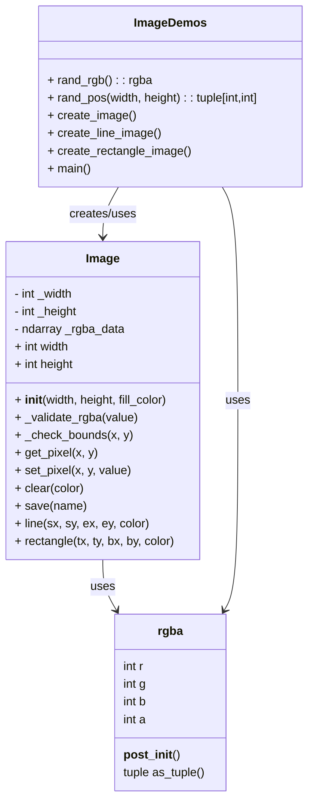

# Image Drawing Library

This project implements a simple image drawing engine in Python. It supports:

- Creating images by pixels
- Drawing lines (Bresenham algorithm)
- Drawing rectangles with clipping
- Saving images to PNG

The repository also contains demo functions that generate colorful images illustrating how the system works.

---

---

# Demos

This section describes each demo function and provides space for example images.

---

## `create_image()`

**Description:**
Fills the entire image with random colors on a per-pixel basis. Useful for testing basic pixel manipulation and color rendering.

**Example Output:**

---

## `create_line_image()`

**Description:**
Draws multiple lines (horizontal, vertical, diagonal) at random positions and in random colors. Demonstrates the `Image.line()` method using Bresenham’s algorithm.

**Example Output:**

---

## `create_rectangle_image()`

**Description:**
Draws multiple rectangles at random positions with random fill colors. Demonstrates the `Image.rectangle()` method with automatic clipping to the image bounds.

**Example Output:**

